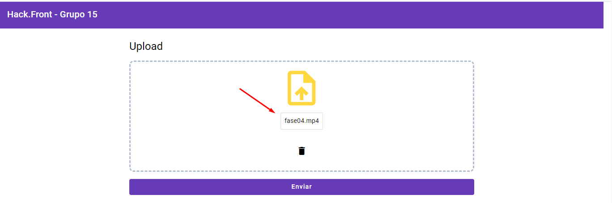
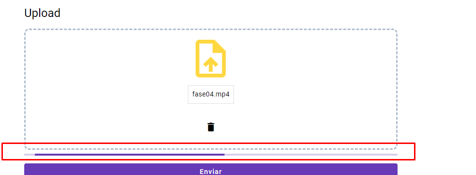
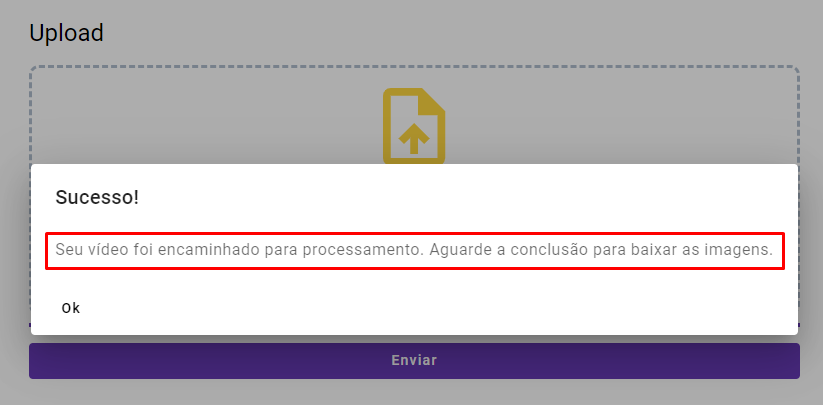
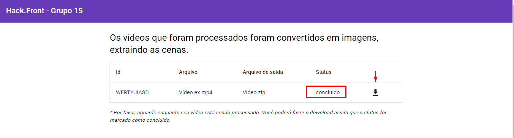
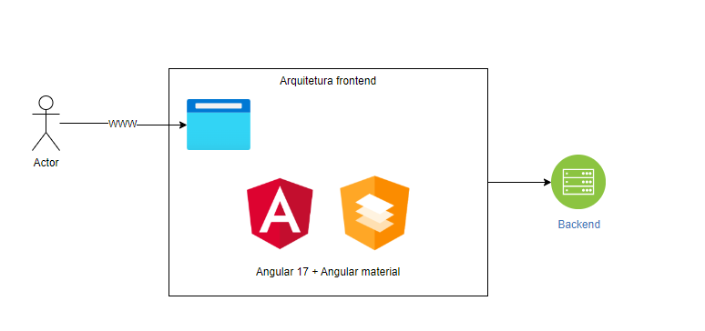
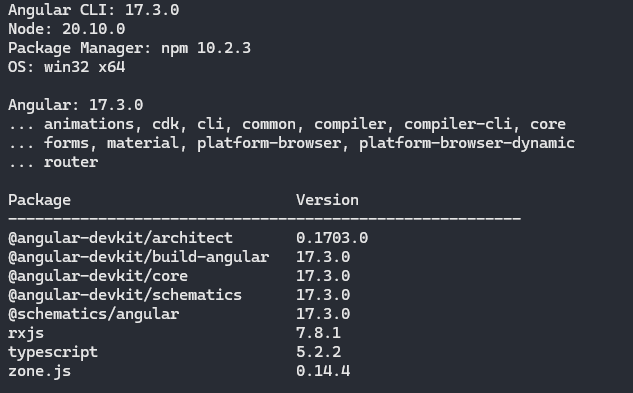

# Hack.Front

Projeto desenvolvido como cliente web para uma ferramenta de processamento de vídeos. Nele, o vídeo é submetido ao nosso serviço e o resultado do processamento é um conjunto de imagens correspondentes a esse vídeo.

# Funcionalidades 

### Upload do vídeo

Atualmente, os usuários podem enviar seus vídeos para serem processados em imagens. O resultado será um arquivo .zip contendo todas as imagens correspondentes ao vídeo.

* Passo 01
  
  Escolha o arquivo de vídeo desejado arrastando-o para a área destacada ou clicando no contêiner:
  

* Passo 02
  
  Pressione o botão "Enviar" para submeter o arquivo para processamento e aguarde até que o envio seja concluído:

  

  O progresso do envio será exibido no item designado.

* Passo 03
  
  Após o envio ser concluído com sucesso, uma mensagem será exibida e você será redirecionado para a tela de download:

  

### Download

* Passo 01
  
  Na lista de downloads, por favor, aguarde até que o vídeo seja processado e o download seja liberado:

  

## Arquitetura frontend

Para desenvolver nosso cliente, optamos pelo framework Angular, que opera como uma aplicação de página única (SPA).

* Angular 17+
* Angular material 17+

## Development server

Execute `ng serve` para subir o servidor de desenvolvimento. Navegue para `http://localhost:4200/`.

## Build

Execute `ng build` para construir o projeto. Os artefatos de construção serão armazenados no diretório `dist/`.

